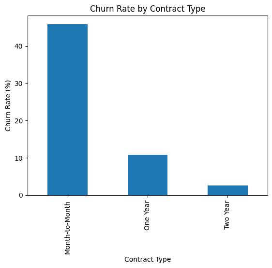
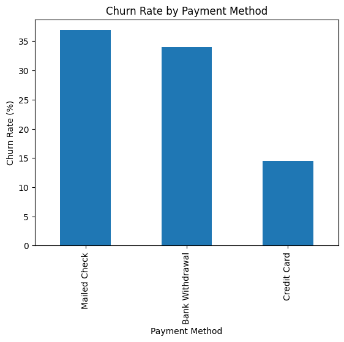
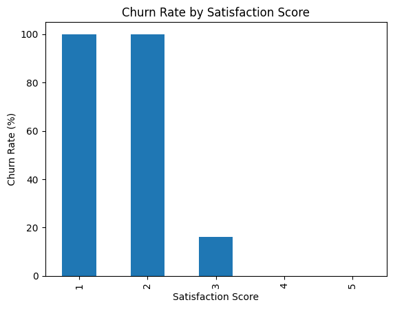

# Customer Churn Analysis

## Overview
This project analyzes customer churn behavior using a telecom dataset to identify key drivers of customer attrition. The objective is to uncover patterns in customer behavior and deliver actionable insights that help improve retention and reduce revenue loss.

## Business Problem
Customer churn negatively impacts revenue and growth. Retaining existing customers is significantly more cost-effective than acquiring new ones. This project focuses on identifying high-risk customers and the factors contributing to churn.

## Objectives
- Calculate overall churn rate
- Identify key factors influencing churn
- Analyze customer demographics and service usage
- Evaluate impact of satisfaction and tenure
- Identify major churn reasons
- Provide data-driven business recommendations

## Dataset Summary
- Total Customers: 7,043
- Key Features:
    - Demographics: Age, Gender, Senior Citizen
    - Account Info: Contract, Payment Method
    - Services: Internet, Streaming, Support
    - Financials: Monthly Charges, Total Revenue
    - Customer Feedback: Satisfaction Score
    - Target Variable: Churn Label
 
## Tools & Technologies
- Python: Pandas, NumPy
- Visualization: Matplotlib, Seaborn
- SQL: Data querying and segmentation
- Environment: Jupyter Notebook, VS Code

## Key Insights
- Overall churn rate: 26.54%
- Customers with month-to-month contracts have the highest churn risk
- Mailed check and bank withdrawal users show higher churn behavior
- Customers with internet services churn more frequently
- Senior citizens have a significantly higher churn rate
- Customers without dependents and not married are more likely to churn
- Low satisfaction scores strongly correlate with churn
- Customers with short tenure are at higher risk
- Major churn drivers:
  - Competitor pricing
  - Poor customer service
  - Service dissatisfaction

## SQL Analysis
SQL queries were used to:
- Compute churn rate and key KPIs
- Segment customers by contract, payment method, and demographics
- Analyze satisfaction score impact
- Identify top churn categories and reasons

## Sample Visualizations

## Business Recommendations
- Promote long-term contracts to reduce churn
- Encourage automatic payment methods
- Improve customer support and service quality
- Target high-risk customer segments with retention offers
- Enhance customer satisfaction and experience
- Strengthen onboarding for new customers
- Optimize pricing strategies to remain competitive

## Conclusion
This analysis identifies critical factors driving customer churn and provides actionable insights for improving retention strategies. By focusing on customer satisfaction, contract structure, and service quality, businesses can reduce churn and increase long-term profitability.

## Author
Shreya Arutla
- GitHub:https://github.com/Sarutla0227
- LinkedIn:https://www.linkedin.com/in/shreya-arutla-361b601a3/

## Project Highlights
- End-to-end data analysis using Python and SQL
- Identified key churn drivers and customer segments
- Built business-focused insights and recommendations

